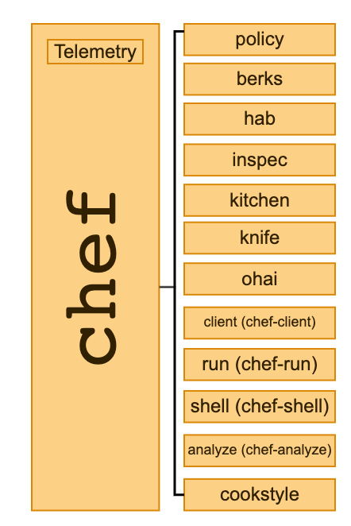

# Chef CLI (Catalog)

Throughout the history of Chef, we have created and acquired a variety
of tools that have grown to a point that, as a Chef Operator, it is
hard to know, discover and understand all of them. A few of the tools
that our users use (almost) every day are:

* chef (CLI that includes Policyfiles management)
* hab (Habitat CLI)
* inspec
* ohai
* kitchen (Test-kitchen)
* knife
* berks (Berkshelf)
* cookstyle
* chef-client
* chef-run/chef-apply
* chef-shell
* chef-solo

Currently, inside the latest version of Chef Workstation (and since version `0.10.41`),
the team has implemented a top-level `chef` command that acts as a wrapper around chef
commands. In this design proposal we expand this scope to be a proxy/catalog of all the
user facing cli tools we package inside Chef Workstation.

Quick diagram that illustrates the new Chef CLI Catalog:



With this architecture, we would be able to integrate and modularize multiple tools
in a single place and make the chef command a first-class citizen of our development
experience. We will also be able to gather immediate information from our users of
all our tools so we can understand what parts of our tooling are the most used and
which areas can we improve.

Once detecting such areas of improvement, we can have the flexibility to improve
tools entirely or sub-sections of the tool. Say for instance, that our users run
`knife search` around 30-50 times a day, if the command takes around 10-15
seconds to run, we are consuming ~10 minutes a day from our users waiting for value.
With this approach we could rewrite that specific sub-command to run 10x faster and
give that time back to our users.


[Gist with a few mocked help commands.](https://gist.github.com/afiune/1dc854089002e182288a0452eaa91908)

## Goals
* Have a single, unified way to discover tools to interact with Chef products
* A path to have consistent/usable performance on all supported platforms
* Gather data about how our users consume and interact with our tools (Telemetry)
* Agreement to a common UX standards of our (CLI) tools
* Have the flexibility to rename tools and commands within our ecosystem
* Enable developers to develop tools in any supported programming languages at Chef

## Motivation

    As a Chef Operator,
    I need a unified Command Line Interface (CLI) that lets me interact with every Chef product,
    so I can easily discover the capabilities of the Chef ecosystem.

    As a Chef Developer,
    I need to be able to gather information about how our users consume and interact with our tools,
    so I can identify which commands are used the most and measure the usability and performance on all supported platforms.

## Specification

### Refactor the `chef-cli` (Policyfiles)
With the purpose of having a better sub-command organization, we need to extract
the Policyfile logic out from the `chef-cli` binary. The commands that need to
be extracted are:

```
  install                 Install cookbooks from a Policyfile and generate a locked cookbook set
  update                  Updates a Policyfile.lock.json with latest run_list and cookbooks
  push                    Push a local policy lock to a policy group on the Chef Infra Server
  show-policy             Show policyfile objects on the Chef Infra Server
  diff                    Generate an itemized diff of two Policyfile lock documents
  export                  Export a policy lock as a Chef Infra Zero code repo
  clean-policy-revisions  Delete unused policy revisions on the Chef Infra Server
  clean-policy-cookbooks  Delete unused policyfile cookbooks on the Chef Infra Server
  delete-policy-group     Delete a policy group on the Chef Infra Server
  delete-policy           Delete all revisions of a policy on the Chef Infra Server
  undelete                Undo a delete command
```

The new binary name proposed is `chef-policy` that could initially be the same policyfiles
ruby code that lives inside the `chef-cli`. The rest of the sub-commands will continue to
live inside the `chef-cli` binary.

The new `chef-policy` should contain the following sub-commands:
```
$ chef-policy install
$ chef-policy update
$ chef-policy push (includes push-archive)
$ chef-policy show
$ chef-policy diff
$ chef-policy export
$ chef-policy delete
$ chef-policy undelete
$ chef-policy clean revisions
$ chef-policy clean cookbooks
$ chef-policy group delete (and more? maybe show a policy group)
```
These sub-commands map to the previous top level policy commands. As an example, the
previous command `chef clean-policy-revisions` would map to the new command
`chef-policy clean revisions`.

Once the new `chef-policy` exists, we need to update the `chef` catalog to point to
the new binary and add a section called "Relocated Commands".

The new help command of the `chef` catalog should look like:
```
$ chef
Usage:
    chef -h/--help
    chef -v/--version
    chef command [arguments...] [options...]

Available Commands:
    env                     Prints environment variables used by Chef Workstation
    gem                     Runs the 'gem' command in context of the embedded Ruby
    exec                    Runs the command in context of the embedded ruby
    shell-init              Initialize your shell to use Chef Workstation as your primary Ruby
    generate                Generate a new repository, cookbook, or other component
    describe-cookbook       Prints cookbook checksum information used for cookbook identifier
    policy                  Manage Chef Policyfiles

Renamed Commands:
    install                 Use: chef policy install
    update                  Use: chef policy update
    push                    Use: chef policy push
    push-archive            Use: chef policy push
    show-policy             Use: chef policy show
    diff                    Use: chef policy diff
    export                  Use: chef policy export
    clean-policy-revisions  Use: chef policy clean revisions
    clean-policy-cookbooks  Use: chef policy clean cookbooks
    delete-policy-group     Use: chef policy group delete
    delete-policy           Use: chef policy delete
    undelete                Use: chef policy undelete

Experimental Commands:
    analyze                 Analyze artifacts from a Chef Infra Server
```

#### Open questions for further discussion with UX:
* How do we want to present these sections? What is the right order?

### Implement Telemetry into the `chef` catalog

To start gathering information from the `chef` catalog we need to create a telemetry
Go library. The design of this work will be captured in a separate document.

### Route tools and binaries through the `chef` catalog

The last thing we propose is routing all our tools and binaries through the `chef`
catalog. An example would be the `hab` and `inspec` binaries that will be routed
as `chef hab` and `chef inspec` accordingly.

The complete output of the `chef` catalog should look like:
```
$ chef
Usage:
    chef -h/--help
    chef -v/--version
    chef command [arguments...] [options...]

Available Commands:
    env                     Prints environment variables used by Chef Workstation
    gem                     Runs the 'gem' command in context of the embedded Ruby
    exec                    Runs the command in context of the embedded ruby
    shell-init              Initialize your shell to use Chef Workstation as your primary Ruby
    generate                Generate a new repository, cookbook, or other component
    describe-cookbook       Prints cookbook checksum information used for cookbook identifier
    policy                  Manage Chef Policyfiles
    hab                     Commands relating to Chef Habitat
    inspec                  Tests and auditing your applications and infrastructure
    kitchen                 Test cookbooks across any combination of platforms and test suites
    knife                   An interface between a local chef-repo and the Chef Infra Server
    ohai                    Collect system configuration data
    client                  Agent that runs locally on every node that is under management by Chef Infra Server
    run                     Execute ad-hoc tasks using Chef
    apply                   Executable program that runs a single recipe
    shell                   A recipe debugging tool that allows the use of breakpoints within recipes
    berks                   Dependency manager for Chef cookbooks
    cookstyle               Code linting tool that helps you write better Chef Infra cookbooks

Relocated Commands:
    install                 Use now: chef policy install
    update                  Use now: chef policy update
    push                    Use now: chef policy push
    push-archive            Use now: chef policy push
    show-policy             Use now: chef policy show
    diff                    Use now: chef policy diff
    export                  Use now: chef policy export
    clean-policy-revisions  Use now: chef policy clean revisions
    clean-policy-cookbooks  Use now: chef policy clean cookbooks
    delete-policy-group     Use now: chef policy group delete
    delete-policy           Use now: chef policy delete
    undelete                Use now: chef policy undelete

Experimental Commands:
    analyze                 Analyze artifacts from a Chef Infra Server
```

### Automation of reference documentation

Motivation:

    As a technical writer
    I want to add examples to the chef catalog documentation
    so that users will know the tricky bits and the documentation gets updated automatically as the code evolves

The documentation team is working towards meaningful automation of our reference
documentation, this includes our CLI tools. This proposal includes working with
the documentation team to implement an automation inside our `chef` catalog by
adding long description, platform, and command example fields to the CLI metadata,
as well as fields for position and use examples for flag.

### EXTRA: Present correct usage of sub-binaries

An additional task from this proposal is the use of an environment variable that
can control the "Usage" message of sub-binaries. Currently, the `chef-analyze`
binary displays the usage message `chef-analyze [command]` when it is run directly
and also when it is run from the `chef` catalog. We would like the usage message
to be consistent with the way users execute the commands so if you run `chef analyze`
the usage should be `chef analyze [command]`; and if you run `chef-analyze` the
usage should continue to be `chef-analyze [command]`.

## Open points for further discussion:
* Are we discouraging the use of individual sub-binaries like `knife` or `chef-run`?
* What happens when a user runs a sub-binary without the prefix `chef`?
    * How do we capture telemetry on usage when users directly access tools? (EG, `berks`, `inspec` instead of `chef berks`, `chef inspec`)
* How are we communicating deprecations? (UX)
* How are we communicating reorganization of sub-commands? (UX)

## Downstream Impact
* Re organization of Policyfiles commands inside the `chef-cli`
* Effortless will need to point to the new `chef-policy`
