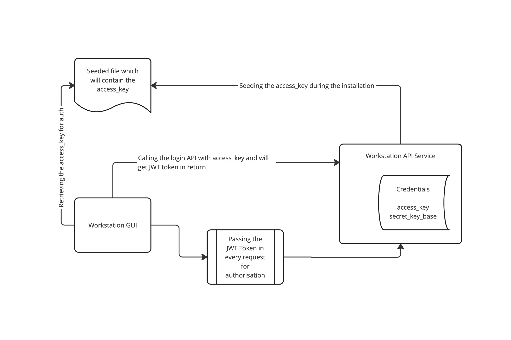

# Workstation API Service
## Overview

This service is a REST API built using Ruby on Rails that serves as an intermediary between the Workstation GUI app and the chef cli.
The chef and knife cli gems are bundled with this service, and the functionalities will be exposed through API so that the Workstation GUI app can consume those and carry out the corresponding actions.

## Authentication

A simple JWT Token based authentication is implemented in order to prevent API invocation from unidentified apps and to confirm the legitimacy of the workstation GUI app.
We are utilising a random access key that will be generated during the installation on the user's machine to authenticate the API.

Below is a list of all the procedures involved in the JWT authentication.

- A new access key and secret key will be generated by the rails application and saved in the rails credentials during the workstation installation.
- Then the access_key will be copied to a file inside the installation directory so that the GUI can access that file and use the access_key for authentication.
- GUI will call the login API with the access_key. 
- The server will verify the access_key with the one saved in the credentials and generated a new JWT token if it is valid.
- The GUI can later on use the JWT token to access the protected URLs. 

