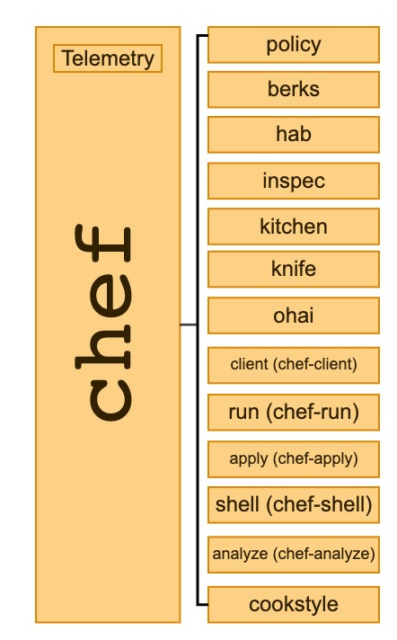
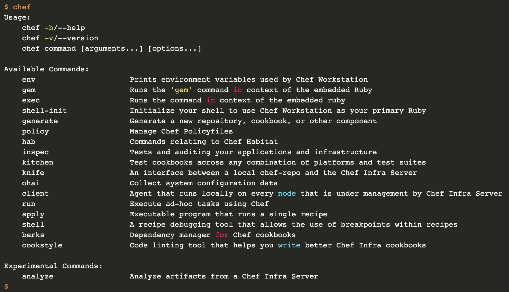

# Chef CLI (Catalog)

Throughout the history of Chef, we have created and acquired a variety
of tools that have grown to a point that, as a Chef Operator, it is
hard to know, discover and understand all of them. A few of the tools
that our users use (almost) every day are:

* chef (CLI that includes Policyfiles management)
* hab (Habitat CLI)
* inspec
* ohai
* kitchen (Test-kitchen)
* knife
* berks (Berkshelf)
* cookstyle
* delivery
* chef-apply
* chef-client
* chef-run
* chef-shell
* chef-solo

## Goals
* Have a single, unified way to discover tools to interact with Chef products
* Consistent/Usable performance on all supported platforms
* Gather data about how our users consume and interact with our tools (Telemetry)
* Standardize the UX of our (CLI) tools
* Have the flexibility to rename tools and commands within our ecosystem
* Enable developers to use any supported programming languages at Chef for efficiency

## Motivation

    As a Chef Operator,
    I need an efficient Command Line Interface (CLI) that lets me interact with every Chef product,
    so I don't have to install multiple tools on my workstation and I can do my day to day work.

    As a Chef developer,
    I need to be able to gather information about how our users consume and interact with our tools,
    so I can identify which commands are used the most and measure the usability and performance on all supported platforms.

## Specification

Currently, inside the latest version of Chef Workstation (and since version `0.10.41`),
the team has implemented a top-level `chef` command that acts as a wrapper around chef
commands. This design proposes we expand this scope to be a proxy/catalog of all the
user facing cli tools we ship.

Quick diagram that illustrates the new Chef CLI Catalog:

With this architecture, we would be able to integrate and modularize multiple tools
in a single place and make the chef command a first citizen of our development
experience. We will also be able to gather immediate information from our users of
all our tools so we can understand what parts of our tooling are the most used and
which areas can we improve.

Once detecting such areas of improvement, we can have the flexibility to improve
tools entirely or sub-sections of the tool. Say for instance, that our users run
`knife search` around 30-50 times a day, if the command takes around 10-15
seconds to run, we are consuming ~10 minutes a day from our users waiting for value.
With this approach we could rewrite that specific command to run 10x faster and
give that time back to our users.

[Gist with a few mocked help commands.](https://gist.github.com/afiune/1dc854089002e182288a0452eaa91908)

## Downstream Impact
TBA

## Milestones
### Implement Telemetry into the top-level chef command
We need to start gathering information about how our users use the chef CLI,
this will allow us to understand the impact that we will have from some major
changes we are about to do.

### Refactor the Chef-CLI
Restructure the chef-cli binary to have a better sub-command distribution,
things that are global to the CLI tool like, chef generate or chef shell-init,
should stay in the binary but we should extract the Policyfile logic out into
its own binary.

### Link tools and binaries to the top-level chef command
Make the top-level chef command to understand all our tools and binaries, that
is, to be able to route sub-commands like chef hab to the hab CLI, and chef
inspec to the inspec CLI.
